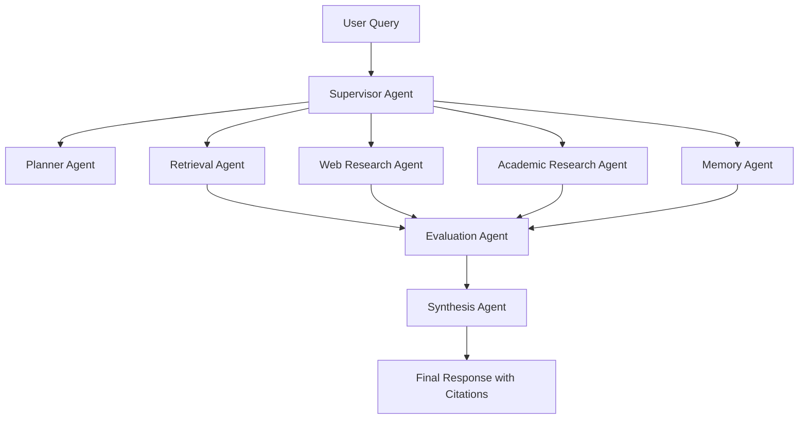

# Architecture

## Notes

- The supervisor handles routing, retries, and trace emission.
- Retrieval is hybrid by default: dense + BM25 + reranking.
- Memory is split into session, user, and semantic layers.
- Evaluation is a first-class agent, not an afterthought.

