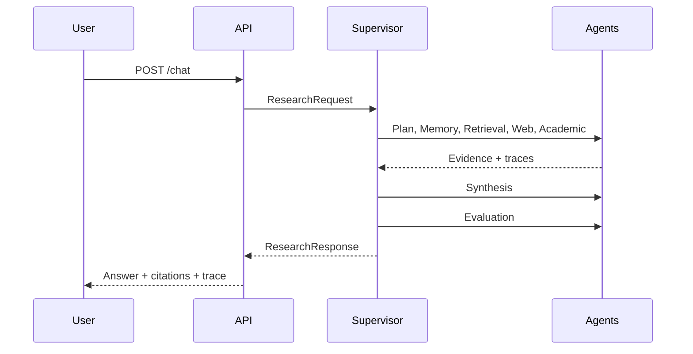

# Sequence

```mermaid
sequenceDiagram
  participant User
  participant API
  participant Supervisor
  participant Agents
  User->>API: POST /chat
  API->>Supervisor: ResearchRequest
  Supervisor->>Agents: Plan, Memory, Retrieval, Web, Academic
  Agents-->>Supervisor: Evidence + traces
  Supervisor->>Agents: Synthesis
  Supervisor->>Agents: Evaluation
  Supervisor-->>API: ResearchResponse
  API-->>User: Answer + citations + trace
```

